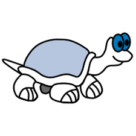

 <h1 align="center">𝓝𝓲𝓴𝓲𝓽𝓪 𝓙𝓪𝓲𝓷</h1>

<!-- 
-->

 

### I am a Backend Software Engineer at Ziploan
- 🔭 I’m currently working on my Django and basic data analysis :grin:
- 🐍 I’m currently learning more about Python!.
- 💬 Ask me about anything, I am happy to help :smile:

 

 

 
&nbsp;
&nbsp;
&nbsp;
&nbsp;

<h2> 🛠 &nbsp;My Tech Stack</h2>

  
 
  
  

 
   
  
  
 
 
<h2>ℹ️ &nbsp;Github Info</h2>

	
  
<b>⚡ Github Stats</b>

